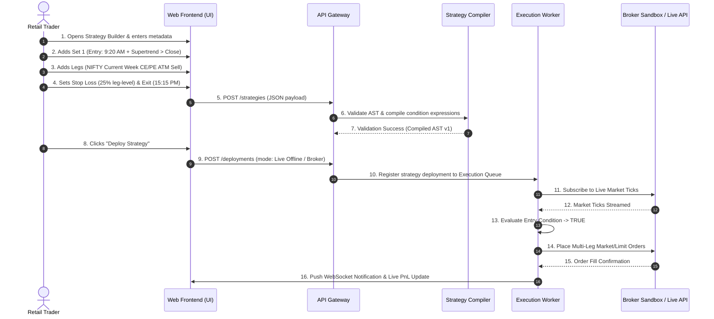

# User Journeys & Workflow Specifications
**Classification:** `VERIFIED` & `PROPOSED`

---

## 1. Journey: Creating and Deploying a Strategy

```mermaid
sequenceDiagram
    autonumber
    actor Trader as Retail Trader
    participant Web as Web Frontend (UI)
    participant API as API Gateway
    participant DSL as Strategy Compiler
    participant Engine as Execution Worker
    participant Broker as Broker Sandbox / Live API

    Trader->>Web: 1. Opens Strategy Builder & enters metadata
    Trader->>Web: 2. Adds Set 1 (Entry: 9:20 AM + Supertrend > Close)
    Trader->>Web: 3. Adds Legs (NIFTY Current Week CE/PE ATM Sell)
    Trader->>Web: 4. Sets Stop Loss (25% leg-level) & Exit (15:15 PM)
    Web->>API: 5. POST /strategies (JSON payload)
    API->>DSL: 6. Validate AST & compile condition expressions
    DSL-->>API: 7. Validation Success (Compiled AST v1)
    Trader->>Web: 8. Clicks "Deploy Strategy"
    Web->>API: 9. POST /deployments (mode: Live Offline / Broker)
    API->>Engine: 10. Register strategy deployment to Execution Queue
    Engine->>Broker: 11. Subscribe to Live Market Ticks
    Broker-->>Engine: 12. Market Ticks Streamed
    Engine->>Engine: 13. Evaluate Entry Condition -> TRUE
    Engine->>Broker: 14. Place Multi-Leg Market/Limit Orders
    Broker-->>Engine: 15. Order Fill Confirmation
    Engine->>Web: 16. Push WebSocket Notification & Live PnL Update
```
