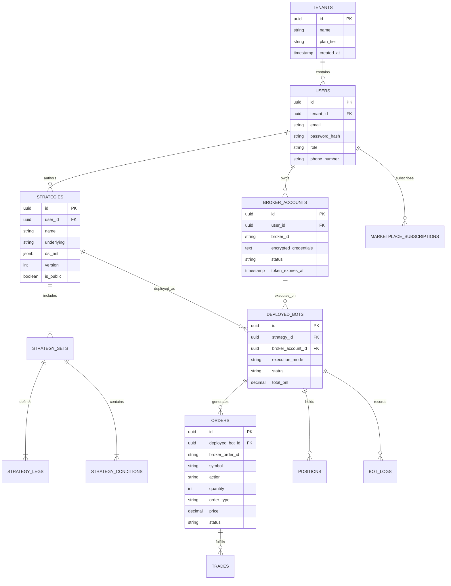

# Database Entity-Relationship Diagram (ERD)
**Classification:** `PROPOSED`

---

## 1. Relational Entity Diagram

```mermaid
erDiagram
    TENANTS ||--o{ USERS : contains
    USERS ||--o{ BROKER_ACCOUNTS : owns
    USERS ||--o{ STRATEGIES : authors
    STRATEGIES ||--|{ STRATEGY_SETS : includes
    STRATEGY_SETS ||--|{ STRATEGY_LEGS : defines
    STRATEGY_SETS ||--|{ STRATEGY_CONDITIONS : contains
    STRATEGIES ||--o{ DEPLOYED_BOTS : deployed_as
    BROKER_ACCOUNTS ||--o{ DEPLOYED_BOTS : executes_on
    DEPLOYED_BOTS ||--o{ ORDERS : generates
    ORDERS ||--o{ TRADES : fulfills
    DEPLOYED_BOTS ||--o{ POSITIONS : holds
    DEPLOYED_BOTS ||--o{ BOT_LOGS : records
    USERS ||--o{ MARKETPLACE_SUBSCRIPTIONS : subscribes

    TENANTS {
        uuid id PK
        string name
        string plan_tier
        timestamp created_at
    }
    USERS {
        uuid id PK
        uuid tenant_id FK
        string email
        string password_hash
        string role
        string phone_number
    }
    STRATEGIES {
        uuid id PK
        uuid user_id FK
        string name
        string underlying
        jsonb dsl_ast
        int version
        boolean is_public
    }
    BROKER_ACCOUNTS {
        uuid id PK
        uuid user_id FK
        string broker_id
        text encrypted_credentials
        string status
        timestamp token_expires_at
    }
    DEPLOYED_BOTS {
        uuid id PK
        uuid strategy_id FK
        uuid broker_account_id FK
        string execution_mode
        string status
        decimal total_pnl
    }
    ORDERS {
        uuid id PK
        uuid deployed_bot_id FK
        string broker_order_id
        string symbol
        string action
        int quantity
        string order_type
        decimal price
        string status
    }
```
