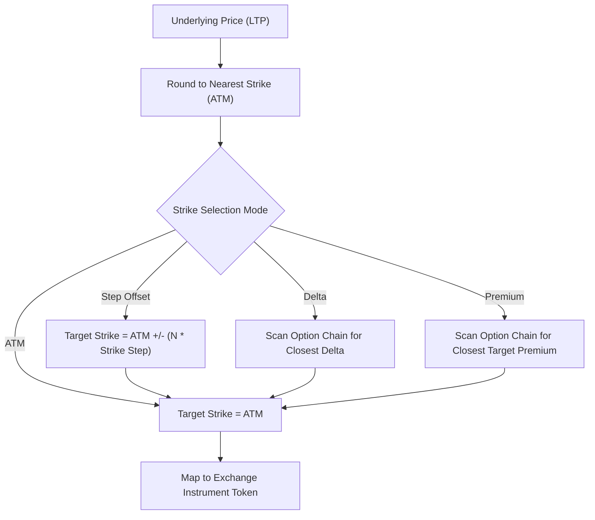

# Options Leg Model & Strike Selection Engine
**Classification:** `PROPOSED`

---

## 1. Strike Offset Resolution Logic

```mermaid
flowchart TD
    UnderlyingPrice["Underlying Price (LTP)"] --> RoundATM["Round to Nearest Strike (ATM)"]
    RoundATM --> ModeCheck{"Strike Selection Mode"}
    
    ModeCheck -- "ATM" --> SelectedStrike["Target Strike = ATM"]
    ModeCheck -- "Step Offset" --> StepCalc["Target Strike = ATM +/- (N * Strike Step)"]
    ModeCheck -- "Delta" --> DeltaScan["Scan Option Chain for Closest Delta"]
    ModeCheck -- "Premium" --> PremiumScan["Scan Option Chain for Closest Target Premium"]
    
    StepCalc --> SelectedStrike
    DeltaScan --> SelectedStrike
    PremiumScan --> SelectedStrike
    SelectedStrike --> ContractLookup["Map to Exchange Instrument Token"]
```
