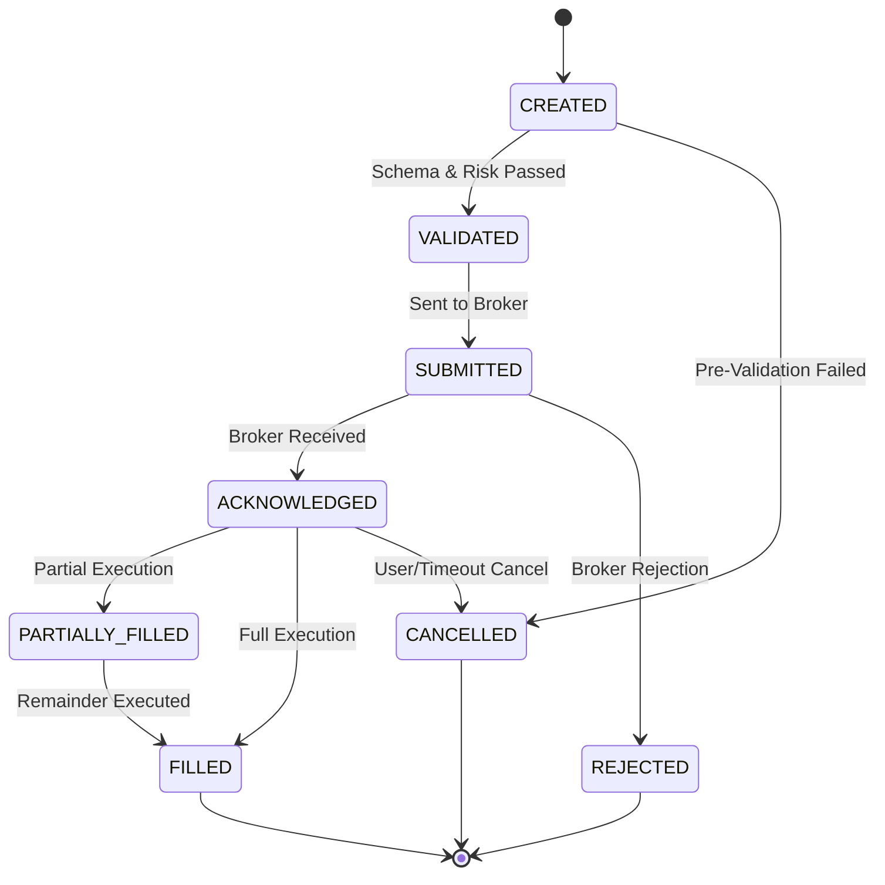

# Order State Machine & Lifecycle
**Classification:** `PROPOSED`

---

## 1. Deterministic State Transitions

```mermaid
stateDiagram-v2
    [*] --> CREATED
    CREATED --> VALIDATED: Schema & Risk Passed
    CREATED --> CANCELLED: Pre-Validation Failed
    VALIDATED --> SUBMITTED: Sent to Broker
    SUBMITTED --> ACKNOWLEDGED: Broker Received
    SUBMITTED --> REJECTED: Broker Rejection
    ACKNOWLEDGED --> PARTIALLY_FILLED: Partial Execution
    PARTIALLY_FILLED --> FILLED: Remainder Executed
    ACKNOWLEDGED --> FILLED: Full Execution
    ACKNOWLEDGED --> CANCELLED: User/Timeout Cancel
    FILLED --> [*]
    REJECTED --> [*]
    CANCELLED --> [*]
```
