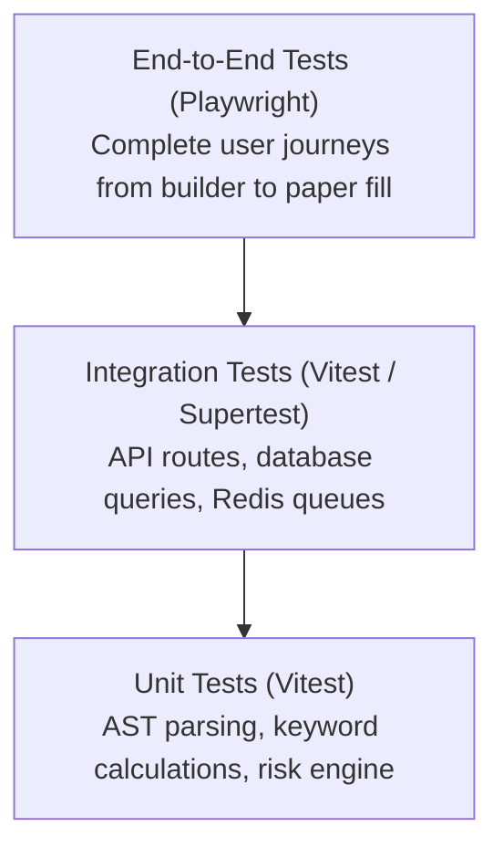

# Test Strategy & Quality Assurance Architecture
**Classification:** `PROPOSED`

---

```mermaid
flowchart TD
    E2E["End-to-End Tests (Playwright)<br/>Complete user journeys from builder to paper fill"] --> Integration["Integration Tests (Vitest / Supertest)<br/>API routes, database queries, Redis queues"]
    Integration --> Unit["Unit Tests (Vitest)<br/>AST parsing, keyword calculations, risk engine"]
```
